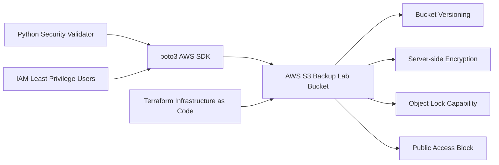

# Autonomous Cyber-Resilience Platform


AI-assisted cyber resilience and backup security validation platform for hybrid cloud environments.

## Overview

This project demonstrates an enterprise-style security validation workflow for cloud backup infrastructure using:

- AWS S3
- Python
- boto3
- IAM
- S3 Object Lock
- Encryption Validation
- Security Automation
- Terraform

The platform validates whether backup storage is configured according to modern cloud security best practices.

---

## Architecture



---

## Current Features

### S3 Security Validation

Automated validation of:

- Bucket Versioning
- Server-side Encryption
- Object Lock capability
- Public Access Block configuration

### AWS Integration

- IAM-based authentication
- AWS CLI integration
- boto3 SDK automation

### Security Controls

- Immutable-storage-ready configuration
- Encrypted object storage
- Public exposure prevention
- Least-privilege IAM access

### Infrastructure as Code with Terraform

The project includes Terraform-based infrastructure deployment for the S3 lab environment.

Terraform provisions:

- S3 bucket
- Bucket versioning
- Server-side encryption
- Public access blocking
- Resource tagging
- Terraform outputs for bucket name, ARN, and region

This demonstrates reproducible infrastructure deployment and cloud security automation using Infrastructure as Code.

---

## Technologies

- Python 3
- AWS S3
- boto3
- IAM
- AWS CLI
- Terraform
- Git
- GitHub
- Infrastructure as Code
- pytest
- GitHub Actions

---

## Project Structure

```text
.
├── .github/workflows/              # GitHub Actions CI pipeline
├── docs/                           # Documentation and example reports
├── infrastructure/terraform/       # Terraform infrastructure definitions
├── reports/                        # Local generated reports, ignored by Git
├── src/tools/                      # Python security validation tools
├── .env.example                    # Example environment configuration
├── .gitignore                      # Excludes secrets, state files, and runtime artifacts
├── README.md                       # Project documentation
└── requirements.txt                # Python dependencies
```

Key components:

- `src/tools/aws_s3_security.py` runs the S3 security validation.
- `infrastructure/terraform/` defines the S3 lab infrastructure as code.
- `docs/example_s3_security_report.json` shows a safe example output.
- `reports/` stores local runtime reports and is intentionally excluded from GitHub.

---

## Local Setup

Clone the repository:

```bash
git clone https://github.com/tomtomson556/autonomous-cyber-resilience-platform.git
cd autonomous-cyber-resilience-platform
```

Create and activate a virtual environment:

```bash
python3 -m venv .venv
source .venv/bin/activate
```

Install dependencies:

```bash
pip install -r requirements.txt
```

Create a local environment file:

```bash
cp .env.example .env
```

Then configure your local `.env` file:

```text
AWS_ACCESS_KEY_ID=your_access_key_here
AWS_SECRET_ACCESS_KEY=your_secret_access_key_here
AWS_DEFAULT_REGION=eu-central-1
BUCKET_NAME=your_s3_bucket_name_here
```

Run the S3 security validator:

```bash
python src/tools/aws_s3_security.py
```
---

## Testing

Run the unit tests locally:

```bash
pytest
```

The project also includes a GitHub Actions CI workflow that automatically validates:

- Python dependency installation
- Python syntax compilation
- Unit tests
- Terraform formatting
- Terraform validation

---

## Example Validation Output

```text
S3 Security Validation Report
============================
Bucket: cyber-resilience-backup-lab-tom-2026

Versioning: PASS
Encryption: PASS
Object Lock: PASS
Public Access Block: PASS

Overall Status: SECURE
```
---

## Security Report Output

The validator also generates a machine-readable JSON report for downstream automation, documentation, or future incident-response workflows.

Generated reports are written locally to:

```text
reports/s3_security_report.json
```

Runtime reports are excluded from GitHub via `.gitignore`.

A safe example report is included here:

```text
docs/example_s3_security_report.json
```

Example JSON report:

```json
{
  "timestamp": "2026-06-03T10:00:00+00:00",
  "bucket": "cyber-resilience-backup-lab-example",
  "checks": {
    "versioning": "PASS",
    "encryption": "PASS",
    "object_lock": "PASS",
    "public_access_block": "PASS"
  },
  "overall_status": "SECURE"
}
```

---

## Terraform Deployment

Terraform configuration is located in:

```text
infrastructure/terraform/
```

Before running Terraform commands, switch into the Terraform directory:

```bash
cd infrastructure/terraform
```

### Validate configuration

```bash
terraform validate
```

### Preview infrastructure changes

```bash
terraform plan
```

### Deploy infrastructure

```bash
terraform apply
```

### Show outputs

```bash
terraform output
```

Example outputs:

```text
bucket_name   = "cyber-resilience-terraform-lab-tom-2026"
bucket_arn    = "arn:aws:s3:::cyber-resilience-terraform-lab-tom-2026"
bucket_region = "eu-central-1"
```

State files are intentionally excluded from GitHub via `.gitignore`.

---

## Security Notes

This project follows core cloud security principles:

- No root-account access for daily operations
- MFA enabled for administrative access
- Dedicated IAM users for separate responsibilities
- Least-privilege IAM policy for the security validator
- Separate Terraform deployer identity for infrastructure deployment
- Environment variables are excluded from GitHub
- Terraform state files are excluded from GitHub
- Public S3 access is blocked by default

---

## Future Roadmap

- Veeam API integration
- AI-based anomaly detection
- Local LLM integration with Ollama
- CrewAI multi-agent orchestration
- Incident response automation
- JSON security reports
- GitHub Actions workflow with OIDC-based AWS authentication

---

## Author

Thomas Tomson
